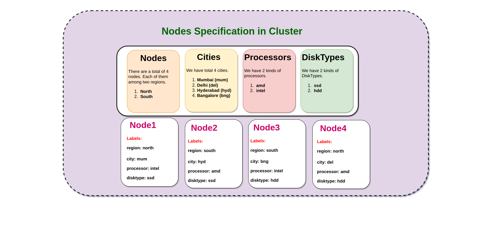

### Kubernetes Scheduling:

_Scheduling in Kubernetes will make sure that the Pods are matched to thier respective nodes so that Kubelet can run them._

* _What are the scheduling Concepts of Kubernetes Advanced Scheduling?_  
_Answer:_

#### Advanced Scheduling:
1. Node
2. Node Selector
3. Affinity
4. Anti-Affinity
5. Taints and Tolerations

* _What are the steps in general followed by the defualt k8s scheduler?_
_Answer:_

1. Check for Hardware Resources.
2. Check for declared for Specific Hardware resources declared in the YAML file.
3. Is the Pod has been requested to run on a specific node.
4. Check for Matched Labels of a Node.
5. Does the nodes have the capability for accepting Volumes(Static or Dynamic).
6. Did the customer applied any kind of Affinity or Anti-Affinity.
7. Is there any Taints and Tolerance applied on a specif node.

* _How to Deploy a Pod in a Specific Node ?_
```yaml
# Node name should be given at the pod specification level
apiVersion: v1
kind: Pod
metadata:
  name: sched-pod
spec:
  containers:
  - name: ubuntu
    image: ubuntu
    command: ['sh','-c','while true;do echo Hello World!!;sleep 25;done']
  nodeName: worker-1
```

* _What are the types od Scheduling Conditions in Kubernetes?_  
_Answer:_
    * Mandate Condition
    * Preferred Condition

* _What are the steps followed by Scheduler before deploying a Pod in a Node?_  
_Answer: kube-scheduler selects a node for the pod in a 2-step operation._
    * Step1: Filtering ==> Filter the list of Nodes
    * Step2: Scoring ==> Check for the Score of the Nodes.

_How to label a Node?_  
_Answer:_
```bash
$ kubectl label node <Node name> <label>
```

* _How to run a Deployment on a specific node based on the Labels?_  
_Answer:_  
```yaml
# This deployment will run on any node that has the label env: test
apiVersion: apps/v1
kind: Deployment
metadata:
  name: sched-deploy
  labels:
    app: test
spec:
  replicas: 1
  selector:
    matchLabels:
      app: test
  template:
     metadata:
       labels:
         app: test
     spec:
       containers:
       - name: ubuntu
         image: ubuntu
         command: ['sh','-c','while true;do echo Hellow World!!;sleep 25;done']
       nodeSelector:
         env: test

```

* _Where should be  the nodeSelector defined in the YAML file?_  
_Answer: The Node Selector need to be placed at the Pod spec._


* _Once the Pod has been deployed based on Node label and the same label has been altered. What happens next ?_  
_Answer: Nothing happens, the Pod will continue to function. The issue arises if the Pod has been destroyed and recreated._


* _If you have given label in the nodeSelector but that label doesn't exist in any of the nodes. Then what happens when you deploy a Pod?_    
_Answer: The Pod will be deployed but will be in pending state._  

Node Affinity: 

Types of Node Affinity:

1. preferredDuringSchedulingIgnoredDuringExecution
2. requiredDuringSchedulingIgnoredDuringExecution

**preferredDuringSchedulingIgnoredDuringExecution:** The condition is to meet the preferred logic if not possible then it's ok to go to the next available one.  
**requiredDuringSchedulingIgnoredDuringExecution**: It is mandatory to meet the condition. If the Condition is not met then do not proceed to the next available one.

Example Cluster Of Nodes.



We have 4 nodes here and all of them have been labelled with their properties.  
_Please run the following commands by replacing them with your node names._  
```bash
# Syntax : label node <node name> <label with key=value

kubectl label node gke-cluster-node-1 region=north
kubectl label node gke-cluster-node-1 city=mum
kubectl label node gke-cluster-node-1 processor=intel
kubectl label node gke-cluster-node-1 disktype=ssd

kubectl label node gke-cluster-node-2 region=south
kubectl label node gke-cluster-node-2 city=hyd
kubectl label node gke-cluster-node-2 processor=amd
kubectl label node gke-cluster-node-2 disktype=ssd

kubectl label node gke-cluster-node-3 region=south
kubectl label node gke-cluster-node-3 city=bng
kubectl label node gke-cluster-node-3 processor=intel
kubectl label node gke-cluster-node-3 disktype=hdd

kubectl label node gke-cluster-node-4 region=north
kubectl label node gke-cluster-node-4 city=del
kubectl label node gke-cluster-node-4 processor=amd
kubectl label node gke-cluster-node-4 disktype=hdd
```

**Requirement1:** _Please Create a Pod, and it must run on any node that belong to the region "South"._

```yaml
apiVersion: v1
kind: Pod
metadata:
  name: pod-schedule
spec:
  containers:
    - name: ubuntu
      image: ubuntu
      command: ['sh','-c','while true;do echo Hello World!!;sleep 25;done']
  affinity:
    nodeAffinity:
      requiredDuringSchedulingIgnoredDuringExecution:
        nodeSelectorTerms:
          - matchExpressions:
            - key: region
              operator: In
              values:
                - south
```  
**Result:** _Here We have two nodes that match the Criteria gke-cluster-node-1 and gke-cluster-node-4, So kubernetes will choose any one of the node and deploy it._  
  * Before implementing the requirement, remote the label region north on nodes ke-cluster-node-1 and gke-cluster-node-4 .
```bash
 kubectl label node gke-cluster-node-1 region-
 kubectl label node gke-cluster-node-4 region-  
 ```
**Note:** Now we dont have any nodes with the label region= north
**Requirement2:** _Please Create a Pod, and it is preferred to run on any node that belong to the region "North"._
```yaml
apiVersion: v1
kind: Pod
metadata:
  name: with-node-affinity
spec:
  containers:
    - name: ubuntu
      image: ubuntu
      command: ['sh','-c','while true;do echo Hello World!!;sleep 25;done']
  affinity:
    nodeAffinity:
      preferredDuringSchedulingIgnoredDuringExecution:
        - weight: 1
          preference:
            matchExpressions:
            - key: another-node-label-key
              operator: In
              values:
              - another-node-label-value
```  
**Result:** Even though there are no nodes with the label **region=north**, still scheduler went ahead scheduling the pod in the available nodes irrespective of criteria as "Preferred" is not a Mandatory condition.

```bash
$ kubectl get pods -o wide
NAME                 READY   STATUS    RESTARTS   AGE    IP          NODE               NOMINATED NODE   READINESS GATES
with-node-affinity   1/1     Running   0          108s   10.76.0.6   gke-cluster-node-3   <none>           <none>
```
**Note:** Add the labels back once this is done.  

**Requirement3:** _Please Create a Pod, and it is preferred to run on any node that belong to the region "North", but it must have a disk-type of ssd._
```yaml

```

**Result:** When filtered with region=north as preferred condition if they exist only 2 nodes will come up i.e,**gke-cluster-node-1** and **gke-cluster-node-4** and after that we have mandatory condition that we need a disktype=ssd, and only gke-cluster-node-1 will fit in the Criteria. hence we get the below result.  
```bash
$ kubectl get pods -o wide
NAME                READY   STATUS    RESTARTS   AGE   IP          NODE                  NOMINATED NODE   READINESS GATES
pod-with-affinity   1/1     Running   0          7s    10.76.3.6   gke-cluster-node-1    <none>           <none>
```
**Requirement4:** _Please Create a Pod, and it must run on any node that belong to the region "South", but the city has to be hyd._
```yaml
apiVersion: v1
kind: Pod
metadata:
  name: pod-with-affinity-1
spec:
  affinity:
    nodeAffinity:
      requiredDuringSchedulingIgnoredDuringExecution:
        nodeSelectorTerms:
          - matchExpressions:
            - key: region
              operator: In
              values:
                - south
      requiredDuringSchedulingIgnoredDuringExecution:
        nodeSelectorTerms:
          - matchExpressions:
            - key: city
              operator: In
              values:
              - hyd
  containers:
    - name: ubuntu
      image: ubuntu
      command: ['sh','-c','while true;do echo Hello World!!;sleep 25;done']
```
**Result:** In this requirement both the conditions that region should be "south" and the city need to be "hyd", need to be satisfied.And only the node **gke-cluster-node-2** satisfies the condition.
```bash
$ kubectl get pods -o wide
NAME                  READY   STATUS    RESTARTS   AGE     IP          NODE                NOMINATED NODE   READINESS GATES
pod-with-affinity-1   1/1     Running   0          3m41s   10.76.2.5   gke-cluster-node-2   <none>           <none>
```


